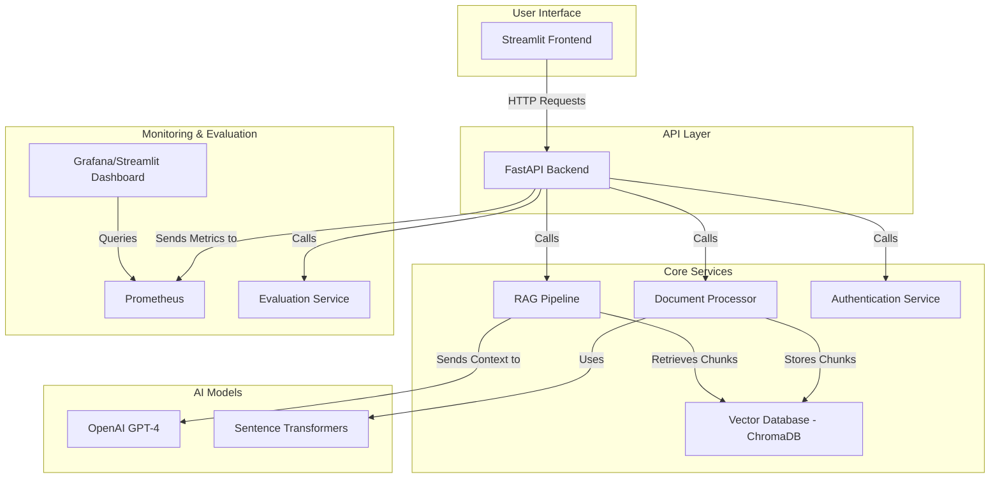

# RAG Query System

[](https://opensource.org/licenses/MIT)

**Turn your documents into a searchable, intelligent knowledge base.**

This project provides a powerful system for asking questions about your private documents in natural language and receiving accurate, context-aware answers. It uses a Retrieval-Augmented Generation (RAG) pipeline to combine the power of Large Language Models with your own data.

---

### **Table of Contents**

- [Live Demo](#live-demo)
- [Key Features](#key-features)
- [Technology Stack](#technology-stack)
- [System Architecture](#system-architecture)
- [Getting Started](#getting-started)
- [Usage](#usage)
- [API Endpoints](#api-endpoints)
- [Project Structure](#project-structure)
- [Contributing](#contributing)
- [License](#license)

---

## Key Features

-   **Multi-format Document Processing**: Ingest PDFs, DOCX, and TXT files.
-   **Advanced Vector Search**: High-quality semantic search with ChromaDB.
-   **RAG-powered Q&A**: Integrates with OpenAI's GPT models for intelligent answers.
-   **User Management**: Secure, token-based authentication (JWT) with RBAC.
-   **Real-time Monitoring**: Dashboards for system health, performance, and analytics.
-   **A/B Testing Framework**: Experiment with different models and prompts.
-   **Response Evaluation**: LLM-as-a-judge for scoring response quality.
-   **Containerized Deployment**: Easy deployment with Docker and Docker Compose.

## Technology Stack

-   **Backend**: FastAPI, Python 3.9+
-   **Frontend**: Streamlit
-   **Database**: SQLite / PostgreSQL
-   **Vector Store**: ChromaDB
-   **Embeddings**: Sentence Transformers
-   **LLM**: OpenAI GPT-4
-   **Deployment**: Docker, Docker Compose
-   **Monitoring**: Prometheus, Grafana

## System Architecture



## Getting Started

### Prerequisites

-   Python 3.9+
-   Docker & Docker Compose
-   OpenAI API Key

### Quick Start

1.  **Clone the repo:**
    ```bash
    git clone https://github.com/nathanko/RAG-Query-System.git && cd RAG-Query-System
    ```
2.  **Set up your environment file:**
    ```bash
    cp backend/.env.example backend/.env
    # Add your OpenAI API key to backend/.env
    ```
3.  **Run with Docker Compose:**
    ```bash
    docker-compose up -d --build
    ```

### Access the Application

-   **Frontend**: `http://localhost:8501`
-   **API Docs**: `http://localhost:8000/docs`

## Usage

Once the application is running, you can:

1.  **Register and log in** through the Streamlit interface.
2.  **Upload documents** via the "Upload" page.
3.  **Ask questions** on the "Q&A" page and get answers from your documents.

## API Endpoints

For a full list of API endpoints, please refer to the **Swagger documentation** available at `http://localhost:8000/docs`.

## Project Structure

```
.
├── backend/         # FastAPI application
├── frontend/        # Streamlit application
├── monitoring/      # Monitoring configuration
├── .github/         # GitHub Actions workflows
├── docker-compose.yml
├── Dockerfile
└── README.md
```

## Contributing

Contributions are welcome! Please feel free to submit a pull request or open an issue.

## License

This project is licensed under the **MIT License**.
